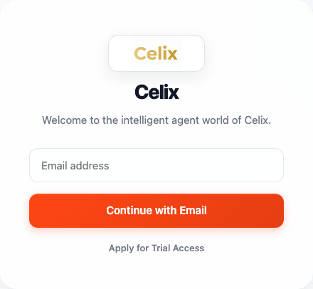
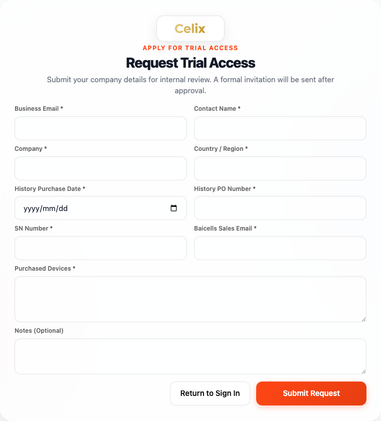
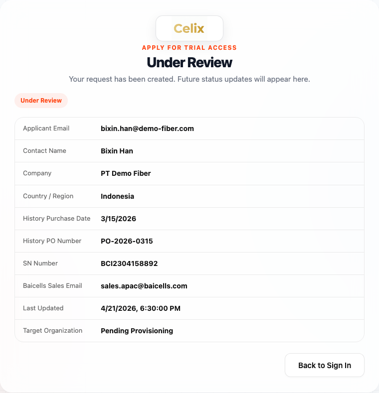
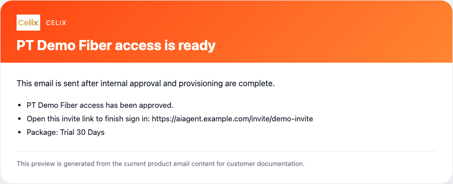
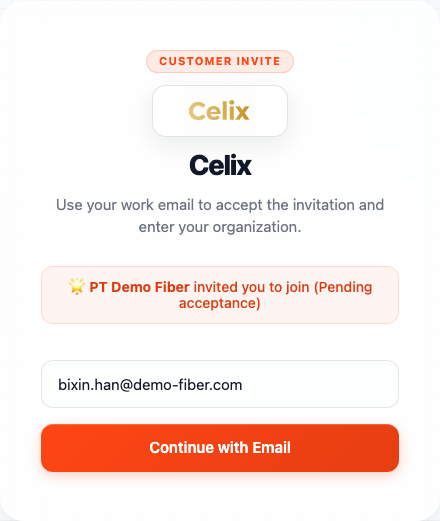
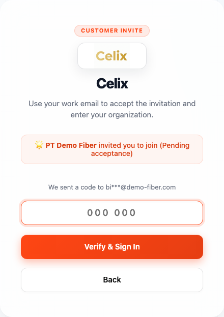
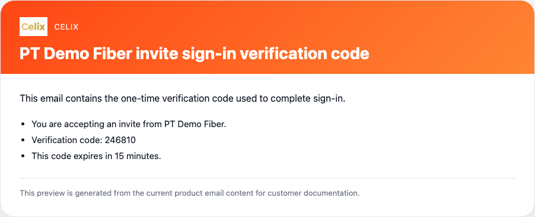
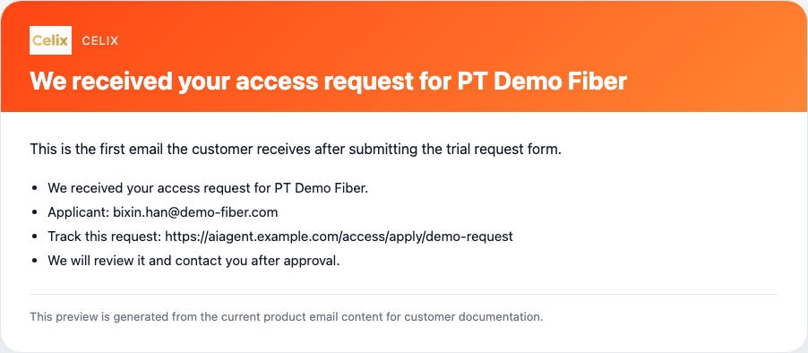

# Celix

## External Customer Quick Start Guide

This guide explains how external customers request access, receive approval, sign in for the first time, and start using Celix.

Access URL: [https://aiagent.indonesiacentral.cloudapp.azure.com/](https://aiagent.indonesiacentral.cloudapp.azure.com/)

All dates and times shown in the web pages follow your local browser time zone.

Use the path that matches your situation:

- If you already received an access invitation email, open the invite link and sign in with your work email.
- If your company does not have access yet, submit `Apply for Trial Access` first.

## Before You Start

Prepare the following information before you submit your request:

- Your company email address
- Contact Name
- Your company name
- Country / Region
- History Purchase Date
- History PO Number
- One Baicells product SN Number
- Your Baicells sales contact email
- Purchased Devices information

## Registration And First Sign-In

### 1. Open the external customer sign-in page

Go to the access URL and choose `Continue with Email`.  
If your company does not have access yet, choose `Apply for Trial Access`.

### 2. Submit an access request

Select `Apply for Trial Access` and complete the request form.

Required fields:

- Business Email
- Contact Name
- Company
- Country / Region
- History Purchase Date
- History PO Number
- SN Number
- Baicells Sales Email
- Purchased Devices

Optional field:

- Notes

The system uses this information for internal review and access approval.

### 3. Check your request status

After submission, the system sends you a confirmation email and gives you a request status link.  
Use that link to check whether your request is still under review, needs more information, or has been approved.

### 4. Wait for the approval email

After your request is approved and access is provisioned, you will receive an `access is ready` email.  
Open the email and select the invite link.

### 5. Open the invitation sign-in page

The invitation page shows your organization, masked email address, membership type, and expiration time.  
Select `Continue with Email` to request a verification code.

### 6. Enter the verification code

Check your mailbox for the verification email, enter the code, and select `Verify & Sign In`.

After verification succeeds, your account is activated and you enter the external customer workspace.

## Emails You May Receive

### 1. Request received

You receive this email immediately after submitting the access request.  
It confirms that your request has been received and includes the status tracking link.

### 2. Access ready

You receive this email after internal approval and access provisioning.  
It includes your invite link and the package that has been enabled for your organization.

### 3. Verification code

You receive this email after you request sign-in verification from the invite page.  
The code is used only for sign-in and expires after a short period.

### Possible additional follow-up emails

Depending on the review result, you may also receive:

- A request for more information
- A rejection notice with the review outcome

## After Sign-In

After you enter the workspace, you can:

- Use the Celix workspace assigned to your organization
- Access the resources and package enabled for your company
- Return later with the same email-based sign-in flow

If your organization has multiple users, each invited user signs in with their own work email and verification code.

## If You Need Help

- If you have not submitted a request yet, use `Apply for Trial Access`.
- If you already received an invite, always sign in from the invite link first.
- If you do not receive the verification code, check your spam folder and then contact your Baicells sales representative or Celix support team.
